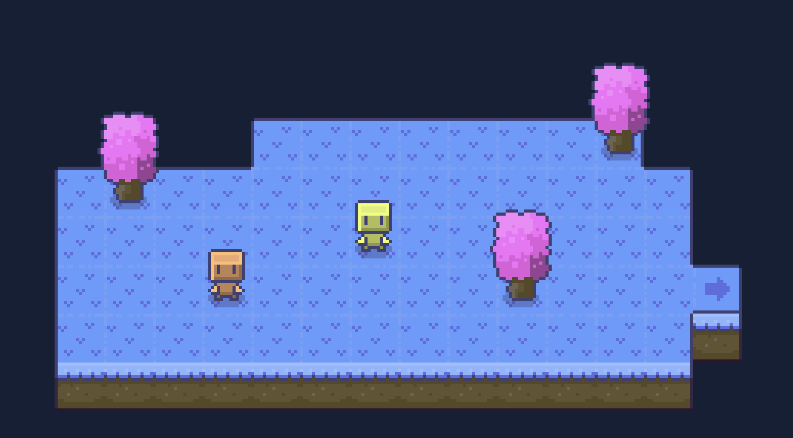

## Sproat Lake 

### Description
Sproat Lake is an RPG maze game written in vanilla JavaScript. The game engine is created through the use of the HTML5 canvas element, classes, and object-oriented programming.

It can be played [here](https://annabrisland.github.io/sproat-lake/).

### Resources
Thanks to [Drew Conley](https://www.youtube.com/@DrewConley/videos) for an introduction to game development with JavaScript.

